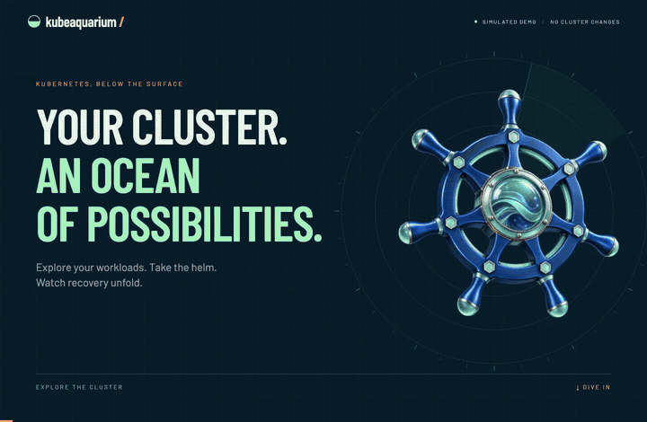
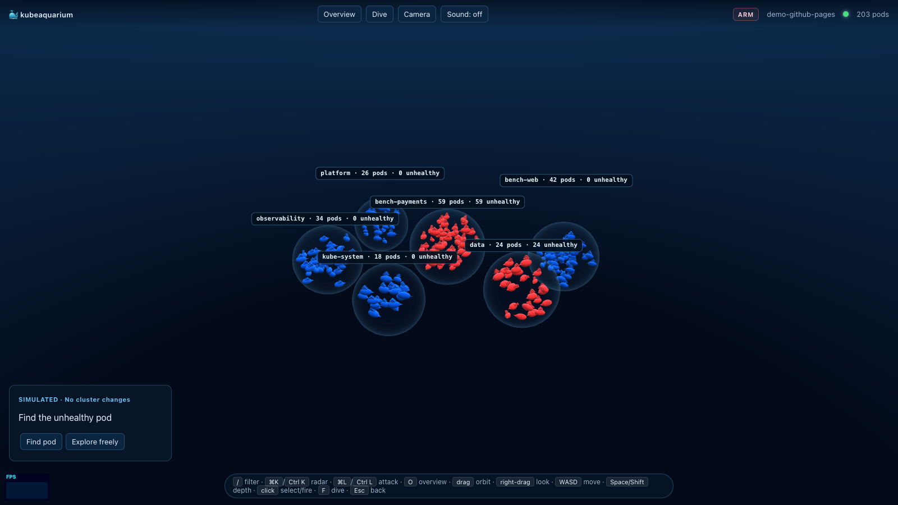
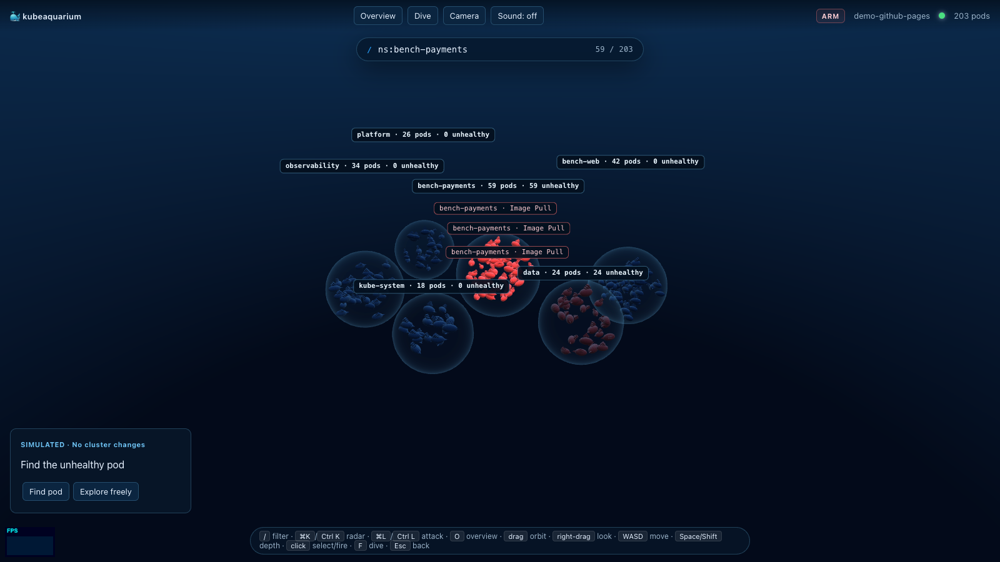
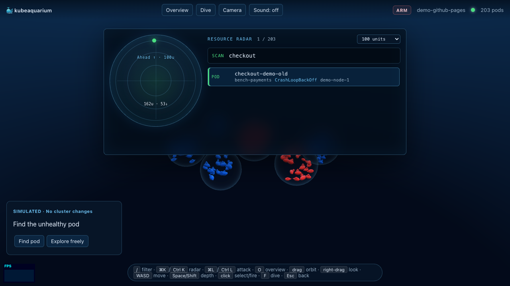
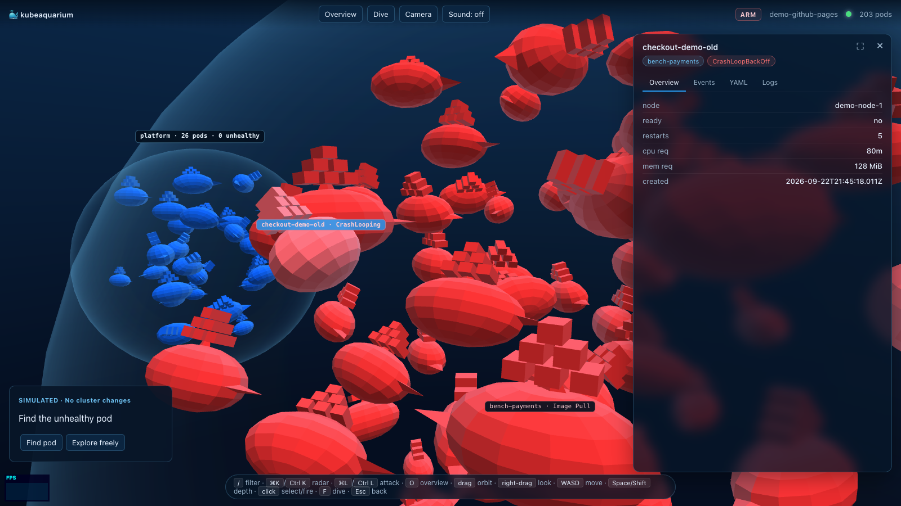
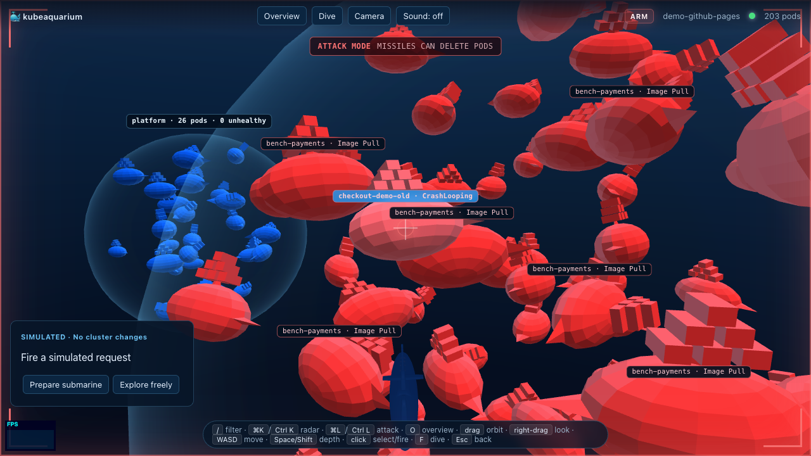

<div align="center">

# 🐳 kubeaquarium

**A live 3D aquarium for your Kubernetes cluster.**

Every pod is a Docker whale. Namespaces are floating bubbles. Broken pods turn red and jitter.
And when you really need to delete one — there's a submarine.

[](https://gabriel-dantas98.github.io/kubeaquarium/)
[](https://github.com/gabriel-dantas98/kubeaquarium/releases)
[](LICENSE)
[](internal/k8s)
[](web/src)

[](docs/video/kubeaquarium-demo.mp4)

**[▶ Watch the full demo](docs/video/kubeaquarium-demo.mp4)** — explore the cluster, find a failing pod, dive in and observe recovery.

*Recorded in the simulated demo. No Kubernetes access or real cluster changes.*

**[▶ Try the live demo](https://gabriel-dantas98.github.io/kubeaquarium/)** — runs entirely in your browser with synthetic cluster data, no Kubernetes required.

</div>

---

## Why

`kubectl get pods` tells you *what* is running. kubeaquarium shows you *how it feels*: a healthy
cluster is a calm blue school of whales; a bad deploy is a bubble full of red, twitching ones.
Pod size maps to requested resources (or configured limits when requests are absent), not
live CPU or memory consumption. It's a real observability tool wearing a game engine costume — filtering, live logs,
events and YAML included. Frame rate depends on workload, browser and hardware.

## Install

```bash
curl -sSfL https://raw.githubusercontent.com/gabriel-dantas98/kubeaquarium/main/scripts/install.sh | sh
```

Or with Go:

```bash
go install github.com/gabriel-dantas98/kubeaquarium/cmd/kubeaquarium@latest
```

Or grab a binary from [Releases](https://github.com/gabriel-dantas98/kubeaquarium/releases).

## Run

```bash
kubeaquarium                    # uses your current kubectl context
kubeaquarium --context my-eks   # pick a context
kubeaquarium --namespace payments --label-selector app=api
kubeaquarium contexts           # list available contexts
```

The browser opens at `http://127.0.0.1:7777`. Whatever cluster your `kubectl` can reach,
kubeaquarium can reach. It never writes to the cluster unless you arm the submarine.

---

## Features

### The aquarium

Namespaces are rim-lit bubbles sized by pod count, with stable centers during the session.
Growing namespaces share available space; dense bubbles retain all pods in search and radar. Whale size
scales with `cpu_requests + memory_requests` (log-mapped, ~5× visual range), so a 2-CPU worker is
unmissable next to its sidecars. Status is color:

| State | Visual |
|---|---|
| Running + Ready | Docker blue |
| Pending / NotReady | desaturated blue |
| CrashLoopBackOff / ImagePullBackOff / Error / Failed | red, jittering |
| Succeeded | green, stationary |
| Terminating | shrinks, sinks, disappears |
| Deletion observed after a missile request | briefly shrinks and disappears |



### k9s-style filtering

Press <kbd>/</kbd> and type. Non-matching whales dim instantly; <kbd>Enter</kbd> dollies the
camera to the closest match.

| Term | Meaning |
|---|---|
| `nginx` | name contains `nginx` |
| `/^worker-/` | name matches regex |
| `ns:web,payments` | namespace in (web, payments) |
| `phase:!Running` | phase is NOT Running |
| `node:control-plane` | node contains `control-plane` |
| `reason:CrashLoopBackOff` | reason is CrashLoopBackOff |

Multiple terms AND together.



### Resource radar

<kbd>Cmd/Ctrl</kbd> + <kbd>K</kbd> opens a sonar-styled command palette: fuzzy-ranked pods by
name, namespace, phase, node or reason. Markers use actual scene positions relative to the
camera heading; choose a range of 50, 100, 250 or 500 units. Arrows indicate relative altitude.
Pods without a scene position remain searchable and show “Position unavailable”.
Select a marker or a result to inspect the same pod.



### Detail panel

Click any whale — it freezes in place and opens its dossier:

- **Overview** — node, ready, restarts, cpu/mem requests, age
- **Events** — last 200 cluster events, warnings highlighted
- **YAML** — pod spec with `managedFields` stripped
- **Logs** — live streaming (HTTP chunked), container picker, follow toggle



### Dive mode

Press <kbd>F</kbd> or **Dive** to pilot the submarine. Hold the right mouse button and drag
to look; use WASD to move and Space/Shift to rise or descend. The reticle stays centered.
**Overview** or <kbd>O</kbd> frames the whole cluster. Escape closes the frontmost panel first.
Typing in panels and losing window focus stop movement.

Camera settings provide look sensitivity, vertical inversion and reduced motion. Reduced
motion starts from your system preference and disables camera shake, inertia, status pulses
and impact flashes. Sound is off by default; enable **Sound** to hear short interaction cues.
These preferences stay in this browser. Audio resumes after returning to the tab only after a gesture.



### Attack mode ⚠️

<kbd>Cmd/Ctrl</kbd> + <kbd>L</kbd> arms the missiles. In live mode, a hit requests a real
pod deletion using the exact pod UID as a precondition. HTTP acceptance means the request
was accepted; it does not prove deletion or recovery.

The recovery panel follows the observed sequence: request accepted, original pod absent,
new candidate with the same controller, then candidate Ready. Multiple candidates or
concurrent targets are reported as ambiguous. Snapshots and reconnects can establish current
state but cannot recover missed timing; incomplete observations are marked accordingly.
Standalone pods have no controller-managed replacement expectation. A container restart
with the same UID is not counted as a replacement. This is observed evidence, not proof that
the request caused a replacement.


Demo mode (`?demo`, including the hosted page) uses synthetic data and local operations.
The visible **SIMULATED** mission walks through finding a failed pod, inspecting it, firing
and observing its replacement. It can be skipped or restarted without accessing Kubernetes.

---

## Architecture

```
┌─────────────────────────── your machine ───────────────────────────┐
│                                                                     │
│  kubeaquarium (single Go binary)                                    │
│  ┌───────────────┐   ┌──────────────┐   ┌───────────────────────┐  │
│  │ client-go     │──▶│ WebSocket hub │──▶│ embedded frontend     │  │
│  │ informers     │   │ snapshot +    │   │ (go:embed, Vite build)│  │
│  │ (pods watch)  │   │ delta events  │   └───────────┬───────────┘  │
│  └──────┬────────┘   └──────────────┘                │              │
│         │            ┌──────────────┐                ▼              │
│         └───────────▶│ pod ops API  │      Three.js renderer        │
│    kubeconfig ctx    │ yaml/events/ │      one InstancedMesh,       │
│                      │ logs/delete  │      boids sim, HUD           │
│                      └──────────────┘                               │
└─────────────────────────────────────────────────────────────────────┘
```

- **`internal/k8s`** — a shared informer watches pods (optionally per-namespace with label
  selectors applied server-side) and projects each pod into a compact `PodView`: name, namespace,
  phase, reason, readiness, node, and summed cpu/mem requests (falling back to limits).
- **`internal/server`** — on connect, a client gets one full snapshot, then incremental
  add/update/delete events and periodic snapshots over WebSocket. Slow clients are disconnected
  and reconnect with a fresh snapshot. Pod operations (YAML, events, chunked log streaming, delete) are plain HTTP.
- **`web/`** — TypeScript + Three.js, no framework. The store applies events; the scene maps each
  pod to an instance slot; the HUD (filter, radar, detail panel, labels, recovery panel) is plain DOM.
- **Demo mode** — `?demo` swaps the WebSocket for a synthetic in-browser stream with the same
  event shape. That's the entire GitHub Pages deployment.

## Rendering and performance

The whole animal kingdom is **one `InstancedMesh`** — one draw call for up to 20k whales, with
per-instance color for status tinting. From there, the tricks stack up:

1. **Vertex-shader animation.** The tail wave is computed in the vertex shader from a `uTime`
   uniform and per-instance state. CPU simulation updates positions.
2. **Boids with a spatial hash.** The swim sim runs per namespace bubble; separation queries use
   a uniform 3D grid instead of O(n²) neighbor checks. Past 1,200 instances — or if FPS dips
   below 24 — it degrades gracefully to cheap bounded wandering.
3. **One event flush per frame.** WebSocket deltas queue up and apply once per rAF tick, so a
   burst of 500 pod updates costs one reconcile pass, not 500.
4. **Adaptive resolution.** Renderer pixel ratio steps down under sustained load and back up when
   the scene calms down.
5. **Pooled everything.** Projectiles, explosion fragments, and bubbles live in fixed-size
   instanced pools with in-place compaction. Labels use bounded reusable DOM pools.
6. **Label culling.** Pod labels are DOM nodes, so only the nearest few render, they're pooled and
   reused, and overlapping ones get collision-culled.
7. **No CSS timelines for critical UI.** Under heavy WebGL load, browsers throttle CSS
   animation/transition clocks. Operation state and overlay dismissal are driven by JavaScript;
   CSS only adds polish.
8. **Server-side narrowing.** `--namespace` and `--label-selector` filter at the informer, so a
   5,000-pod cluster doesn't have to reach the browser to show you one team's workloads.

Frame-time measurements use separate synthetic loads of 200, 1,200 and 2,500 pods.
Current validation and limitations are indexed in
[`docs/validation/game-experience-2026-09-22.md`](docs/validation/game-experience-2026-09-22.md);
older results in [`docs/benchmarks/`](docs/benchmarks/) describe their recorded revisions and hardware.

## Development

```bash
make cluster        # spin up a local kind cluster
make samples        # deploy sample workloads across namespaces
make web-deps       # install frontend deps (one-time)
make run            # build + start http://127.0.0.1:7777

make web-dev        # HMR via vite on :5173 (proxies /api → backend)
make scale N=500    # stress test

# regenerate the demo video (Remotion + Playwright choreography)
cd video && pnpm install
DEMO_URL='http://127.0.0.1:7781/?demo' pnpm run capture && pnpm run render
```

Repo layout:

| Path | What |
|---|---|
| `cmd/kubeaquarium/` | CLI entrypoint |
| `internal/k8s/` | informers + pod ops (yaml, events, logs, delete) |
| `internal/server/` | HTTP + WebSocket hub |
| `internal/webassets/` | embedded frontend (`go:embed`) |
| `web/` | Vite + TypeScript + Three.js |
| `deploy/kind/` | local cluster + sample manifests |
| `video/` | Remotion project for the demo video |
| `docs/superpowers/specs/` | design docs |

## License

MIT — see [LICENSE](LICENSE).

---

<div align="center">

*If a missile takes out the wrong pod in production, the submarine did it.* 🫡

</div>

## Verifying the experience locally

Run `npm --prefix web run dev -- --host 127.0.0.1 --port 7781`, then open
`http://127.0.0.1:7781/?demo`. Browser checks use synthetic data:

```bash
export DEMO_URL='http://127.0.0.1:7781/?demo'
node video/scripts/check-navigation.mjs
node video/scripts/check-scene.mjs
node video/scripts/check-radar.mjs
node video/scripts/check-labels.mjs
node video/scripts/check-audio.mjs
node video/scripts/test-recovery.mjs
node video/scripts/check-demo-mission.mjs
node video/scripts/verify-recovery.mjs
```

The scene and radar checks cover layout bounds, pod states, focus, impact budgets and
50 refresh cycles; the labels check covers transient identities and bounded DOM reuse.
Full performance evidence is recorded separately with its machine, browser, effective DPR
and sampling protocol. Capacity limits are not a frame-rate guarantee.
