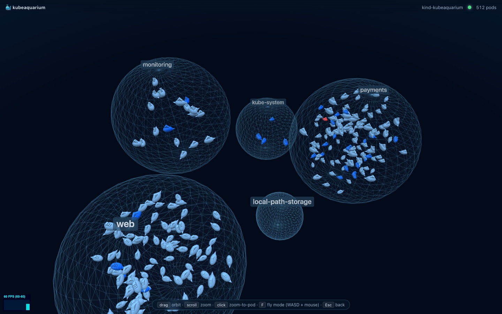
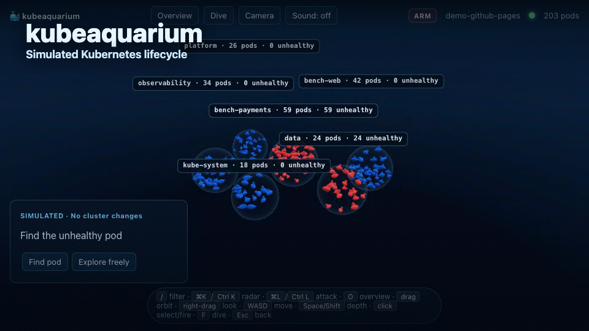

# 🐳 kubeaquarium

A live 3D aquarium for your Kubernetes cluster. Each pod is a tiny Docker whale, namespaces are floating bubbles, and you can dive in. Hybrid 3rd-/1st-person camera, k9s-style filtering, live log streaming, low-poly geometry, instanced rendering — built for 60 FPS.



## Demo

[](docs/video/kubeaquarium-demo.mp4)

[Watch the MP4 demo](docs/video/kubeaquarium-demo.mp4). It was captured from kubeaquarium running against a real Kubernetes cluster with `--namespace monitoring`, then composed with Remotion.

## Install

```bash
curl -sSfL https://raw.githubusercontent.com/gabriel-dantas98/kubeaquarium/main/scripts/install.sh | sh
```

Or with Go:

```bash
go install github.com/gabriel-dantas98/kubeaquarium/cmd/kubeaquarium@latest
```

Or grab a release archive from [Releases](https://github.com/gabriel-dantas98/kubeaquarium/releases) and drop the binary in your `PATH`.

## Run

```bash
kubeaquarium                    # uses your current kubectl context
kubeaquarium --context my-eks   # pick a context
kubeaquarium --namespace payments --label-selector app=api
kubeaquarium --namespace default,kube-system --label-selector 'tier in (frontend,backend)'
kubeaquarium contexts           # list available contexts
kubeaquarium version
```

The browser opens automatically at `http://127.0.0.1:7777`. Whatever cluster your `kubectl` can already reach, kubeaquarium can reach.

### Server-side loading filters

Use these when you want kubeaquarium to avoid loading the whole cluster:

| Flag | Meaning |
|---|---|
| `--namespace payments` | watch only one namespace |
| `--namespace payments,default` | watch multiple namespaces |
| `--namespace payments --namespace default` | same, repeatable form |
| `--label-selector app=api` | watch only pods matching Kubernetes labels |
| `--label-selector 'tier in (frontend,backend)'` | full Kubernetes label selector syntax |

Namespace filtering is applied at informer creation. For multiple namespaces, kubeaquarium starts one namespaced informer per namespace instead of watching all namespaces.

```
     _         _                                       _
    | | ___   _| |__   ___  __ _  __ _ _   _  __ _ _ __(_)_   _ _ __ ___
    | |/ / | | | '_ \ / _ \/ _` |/ _` | | | |/ _` | '__| | | | | '_ ` _ \
    |   <| |_| | |_) |  __/ (_| | (_| | |_| | (_| | |  | | |_| | | | | | |
    |_|\_\\__,_|_.__/ \___|\__,_|\__, |\__,_|\__,_|_|  |_|\__,_|_| |_| |_|
                                  |___/
    a 3D aquarium for your Kubernetes cluster

    context:  kind-kubeaquarium
    ready  :  http://127.0.0.1:7777
```

## Controls

| Action | Key |
|---|---|
| Filter pods (k9s-style)   | <kbd>/</kbd> |
| Resource radar            | <kbd>Cmd/Ctrl</kbd> + <kbd>K</kbd> |
| Orbit                     | drag |
| Zoom                      | scroll |
| Select & freeze a whale   | click |
| Fly mode (1st person)     | <kbd>F</kbd> (then WASD + mouse, Space/Shift up/down) |
| Back to orbit / close panel | <kbd>Esc</kbd> |

## Filter syntax

| Term | Meaning |
|---|---|
| `nginx` | name contains `nginx` |
| `/^worker-/` | name matches regex |
| `ns:web` | namespace is `web` |
| `ns:web,payments` | namespace in (web, payments) |
| `phase:Running` | phase is Running |
| `phase:!Running` | phase is NOT Running |
| `node:control-plane` | node contains `control-plane` |
| `reason:CrashLoopBackOff` | reason is CrashLoopBackOff |

Multiple terms = AND. Press <kbd>Enter</kbd> to dolly to the closest match.

## Pod → whale mapping

| Aspect | Visual |
|---|---|
| Size | scales with `cpu_requests + memory_requests` (log-mapped, clamped) |
| Color: Running + Ready | Docker blue |
| Color: Pending / NotReady | desaturated blue |
| Color: CrashLoopBackOff / ImagePullBackOff / Error / Failed | red, jittering |
| Color: Succeeded | green |
| Terminating | shrink + sink, then disappear |
| Selected | brighter, frozen in place |

## Detail panel (click a whale)

- **Overview** — namespace, node, ready, restarts, cpu/mem requests, created
- **Events** — last 200 events from the cluster, warnings highlighted
- **YAML** — pod spec (managedFields stripped)
- **Logs** — streaming via HTTP chunked, container picker, follow toggle, clear button

## Performance

Verified under headless puppeteer on M-series Mac (Chromium):

- 28 pods → 60 FPS sustained
- 342 pods + simulation + filter + labels → 60 FPS sustained, 60 FPS under simulated drag stress
- 0 page errors

All whales render in a single `InstancedMesh` (one draw call). Tail wave animation runs in the vertex shader. Movement uses a boids-style sim partitioned by namespace bubble with a uniform 3D grid for separation queries.

For large clusters, kubeaquarium coalesces WebSocket updates once per animation frame, grows namespace bubbles proportionally to pod count, spreads namespaces across a larger phyllotaxis layout, lowers renderer pixel ratio under load, and switches from full boids to cheaper bounded swimming above high pod counts. Use `--namespace` and `--label-selector` to keep very large clusters focused before they reach the browser.

## Local development

```bash
make cluster        # spin up a local kind cluster
make samples        # deploy sample workloads across namespaces
make web-deps       # install frontend deps (one-time)
make run            # builds + starts http://127.0.0.1:7777

# in a second terminal: HMR with vite
make web-dev        # http://localhost:5173 (proxies /api → backend)

# stress test
make scale N=500

# regenerate the README demo video
cd video
pnpm install
DEMO_URL=http://127.0.0.1:7781 pnpm run capture
pnpm run render
```

## Layout

- `cmd/kubeaquarium/` — CLI entrypoint (Go)
- `internal/cli/` — banner, browser-open, port fallback, version
- `internal/k8s/` — informer + pod-ops (yaml, events, logs, containers)
- `internal/server/` — HTTP + WebSocket
- `internal/webassets/` — embeds the built frontend (`go:embed`)
- `web/` — Vite + TypeScript + Three.js source
- `deploy/kind/` — local cluster + sample manifests
- `docs/superpowers/specs/` — design docs
- `scripts/install.sh` — one-line installer

## License

MIT
