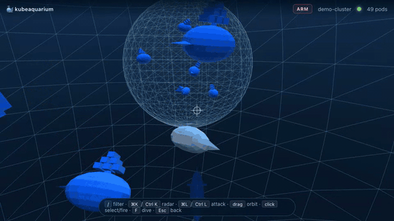
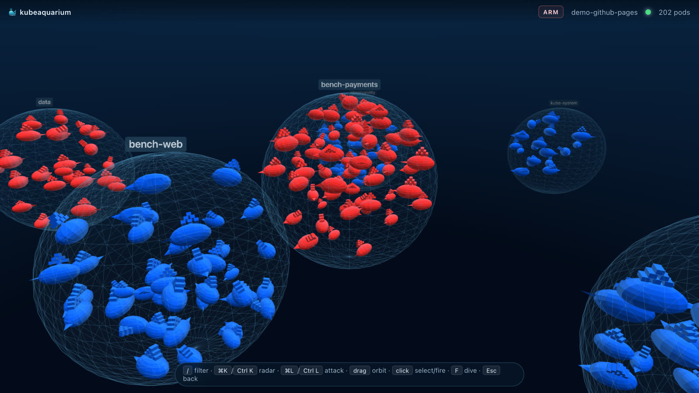
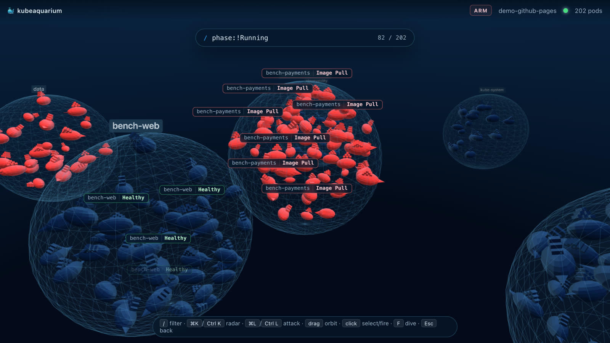
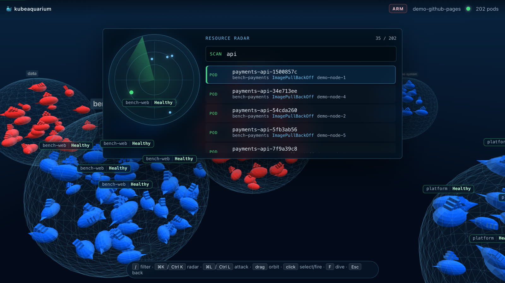
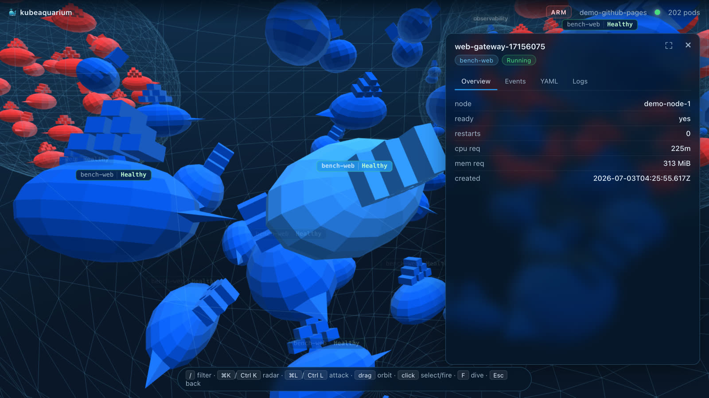
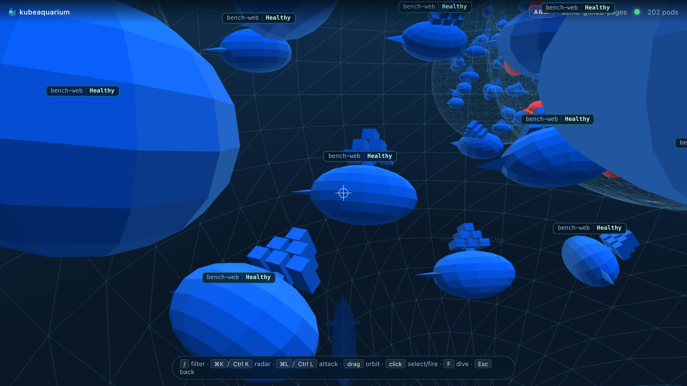
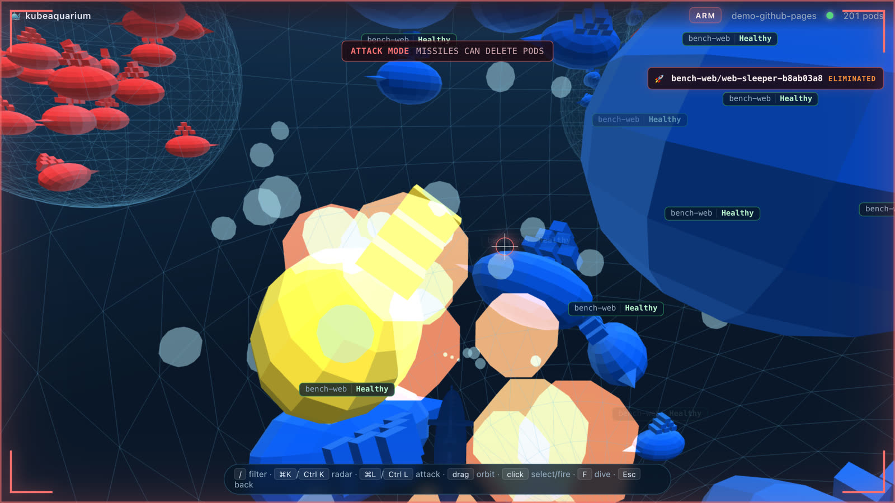

<div align="center">

# 🐳 kubeaquarium

**A live 3D aquarium for your Kubernetes cluster.**

Every pod is a Docker whale. Namespaces are floating bubbles. Broken pods turn red and jitter.
And when you really need to delete one — there's a submarine.

[](https://gabriel-dantas98.github.io/kubeaquarium/)
[](https://github.com/gabriel-dantas98/kubeaquarium/releases)
[](LICENSE)
[](internal/k8s)
[](web/src)



*A real missile deleting a real pod — and the ReplicaSet calmly putting it back.*

**[▶ Try the live demo](https://gabriel-dantas98.github.io/kubeaquarium/)** — runs entirely in your browser with synthetic cluster data, no Kubernetes required.

</div>

---

## Why

`kubectl get pods` tells you *what* is running. kubeaquarium shows you *how it feels*: a healthy
cluster is a calm blue school of whales; a bad deploy is a bubble full of red, twitching ones.
Pod size maps to resource requests, so the expensive workloads literally swim heavier than the
sidecars. It's a real observability tool wearing a game engine costume — filtering, live logs,
events and YAML included — and it holds 60 FPS while doing it.

## Install

```bash
curl -sSfL https://raw.githubusercontent.com/gabriel-dantas98/kubeaquarium/main/scripts/install.sh | sh
```

Or with Go:

```bash
go install github.com/gabriel-dantas98/kubeaquarium/cmd/kubeaquarium@latest
```

Or grab a binary from [Releases](https://github.com/gabriel-dantas98/kubeaquarium/releases).

## Run

```bash
kubeaquarium                    # uses your current kubectl context
kubeaquarium --context my-eks   # pick a context
kubeaquarium --namespace payments --label-selector app=api
kubeaquarium contexts           # list available contexts
```

The browser opens at `http://127.0.0.1:7777`. Whatever cluster your `kubectl` can reach,
kubeaquarium can reach. It never writes to the cluster unless you arm the submarine.

---

## Features

### The aquarium

Namespaces are wireframe bubbles sized by pod count, laid out on a phyllotaxis spiral. Whale size
scales with `cpu_requests + memory_requests` (log-mapped, ~5× visual range), so a 2-CPU worker is
unmissable next to its sidecars. Status is color:

| State | Visual |
|---|---|
| Running + Ready | Docker blue |
| Pending / NotReady | desaturated blue |
| CrashLoopBackOff / ImagePullBackOff / Error / Failed | red, jittering |
| Succeeded | green |
| Terminating | shrinks, sinks, disappears |
| Killed by missile | pops (1.15×), then implodes |



### k9s-style filtering

Press <kbd>/</kbd> and type. Non-matching whales dim instantly; <kbd>Enter</kbd> dollies the
camera to the closest match.

| Term | Meaning |
|---|---|
| `nginx` | name contains `nginx` |
| `/^worker-/` | name matches regex |
| `ns:web,payments` | namespace in (web, payments) |
| `phase:!Running` | phase is NOT Running |
| `node:control-plane` | node contains `control-plane` |
| `reason:CrashLoopBackOff` | reason is CrashLoopBackOff |

Multiple terms AND together.



### Resource radar

<kbd>Cmd/Ctrl</kbd> + <kbd>K</kbd> opens a sonar-styled command palette: fuzzy-ranked pods by
name, namespace, phase, node or reason. Select one and the camera flies to it.



### Detail panel

Click any whale — it freezes in place and opens its dossier:

- **Overview** — node, ready, restarts, cpu/mem requests, age
- **Events** — last 200 cluster events, warnings highlighted
- **YAML** — pod spec with `managedFields` stripped
- **Logs** — live streaming (HTTP chunked), container picker, follow toggle



### Dive mode

Press <kbd>F</kbd> to leave orbit and pilot a submarine in first person (WASD + mouse,
Space/Shift for depth). Engine bubbles, hull collision, the works.



### Attack mode ⚠️

<kbd>Cmd/Ctrl</kbd> + <kbd>L</kbd> arms the missiles. This is the part your SRE lead should know
about: a missile hit performs a real `DELETE` on the pod through your active context. The whale
pops, a kill feed entry logs the elimination FPS-style — and then Kubernetes does the beautiful
part: the ReplicaSet spawns a replacement and a new whale swims in. Chaos engineering with a
periscope.



Demo mode (the [hosted page](https://gabriel-dantas98.github.io/kubeaquarium/)) fakes the
deletion locally, so feel free to go full torpedo.

---

## Architecture

```
┌─────────────────────────── your machine ───────────────────────────┐
│                                                                     │
│  kubeaquarium (single Go binary)                                    │
│  ┌───────────────┐   ┌──────────────┐   ┌───────────────────────┐  │
│  │ client-go     │──▶│ WebSocket hub │──▶│ embedded frontend     │  │
│  │ informers     │   │ snapshot +    │   │ (go:embed, Vite build)│  │
│  │ (pods watch)  │   │ delta events  │   └───────────┬───────────┘  │
│  └──────┬────────┘   └──────────────┘                │              │
│         │            ┌──────────────┐                ▼              │
│         └───────────▶│ pod ops API  │      Three.js renderer        │
│    kubeconfig ctx    │ yaml/events/ │      one InstancedMesh,       │
│                      │ logs/delete  │      boids sim, HUD           │
│                      └──────────────┘                               │
└─────────────────────────────────────────────────────────────────────┘
```

- **`internal/k8s`** — a shared informer watches pods (optionally per-namespace with label
  selectors applied server-side) and projects each pod into a compact `PodView`: name, namespace,
  phase, reason, readiness, node, and summed cpu/mem requests (falling back to limits).
- **`internal/server`** — on connect, a client gets one full snapshot, then incremental
  add/update/delete events over WebSocket. Backpressure drops deltas — the next snapshot
  reconciles. Pod operations (YAML, events, chunked log streaming, delete) are plain HTTP.
- **`web/`** — TypeScript + Three.js, no framework. The store applies events; the scene maps each
  pod to an instance slot; the HUD (filter, radar, detail panel, labels, kill feed) is plain DOM.
- **Demo mode** — `?demo` swaps the WebSocket for a synthetic in-browser stream with the same
  event shape. That's the entire GitHub Pages deployment.

## How it stays at 60 FPS

The whole animal kingdom is **one `InstancedMesh`** — one draw call for up to 20k whales, with
per-instance color for status tinting. From there, the tricks stack up:

1. **Vertex-shader animation.** The tail wave is computed in the vertex shader from a `uTime`
   uniform and per-instance phase. The CPU animates zero whales.
2. **Boids with a spatial hash.** The swim sim runs per namespace bubble; separation queries use
   a uniform 3D grid instead of O(n²) neighbor checks. Past 1,200 instances — or if FPS dips
   below 24 — it degrades gracefully to cheap bounded wandering.
3. **One event flush per frame.** WebSocket deltas queue up and apply once per rAF tick, so a
   burst of 500 pod updates costs one reconcile pass, not 500.
4. **Adaptive resolution.** Renderer pixel ratio steps down under sustained load and back up when
   the scene calms down.
5. **Pooled everything.** Projectiles, explosion fragments, and bubbles live in fixed-size
   instanced pools with in-place compaction; hot paths reuse preallocated temp vectors —
   no per-frame allocations, no GC hitches.
6. **Label culling.** Pod labels are DOM nodes, so only the nearest few render, they're pooled and
   reused, and overlapping ones get collision-culled.
7. **No CSS timelines for critical UI.** Under heavy WebGL load, browsers throttle CSS
   animation/transition clocks (we learned this the fun way). Anything that must happen — kill
   feed removal, overlay dismissal — is driven by JS timers; CSS only ever adds polish.
8. **Server-side narrowing.** `--namespace` and `--label-selector` filter at the informer, so a
   5,000-pod cluster doesn't have to reach the browser to show you one team's workloads.

Measured on an M-series Mac (headless Chromium): 342 pods with sim + filter + labels active
sustains 60 FPS, including under drag stress. Evidence in [`docs/benchmarks/`](docs/benchmarks/).

## Development

```bash
make cluster        # spin up a local kind cluster
make samples        # deploy sample workloads across namespaces
make web-deps       # install frontend deps (one-time)
make run            # build + start http://127.0.0.1:7777

make web-dev        # HMR via vite on :5173 (proxies /api → backend)
make scale N=500    # stress test

# regenerate the demo video (Remotion + Playwright choreography)
cd video && pnpm install
DEMO_URL=http://127.0.0.1:7781 pnpm run capture && pnpm run render
```

Repo layout:

| Path | What |
|---|---|
| `cmd/kubeaquarium/` | CLI entrypoint |
| `internal/k8s/` | informers + pod ops (yaml, events, logs, delete) |
| `internal/server/` | HTTP + WebSocket hub |
| `internal/webassets/` | embedded frontend (`go:embed`) |
| `web/` | Vite + TypeScript + Three.js |
| `deploy/kind/` | local cluster + sample manifests |
| `video/` | Remotion project for the demo video |
| `docs/superpowers/specs/` | design docs |

## License

MIT — see [LICENSE](LICENSE).

---

<div align="center">

*If a missile takes out the wrong pod in production, the submarine did it.* 🫡

</div>
